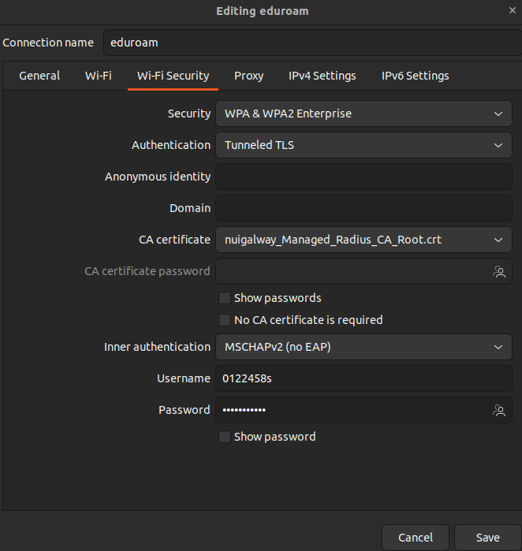
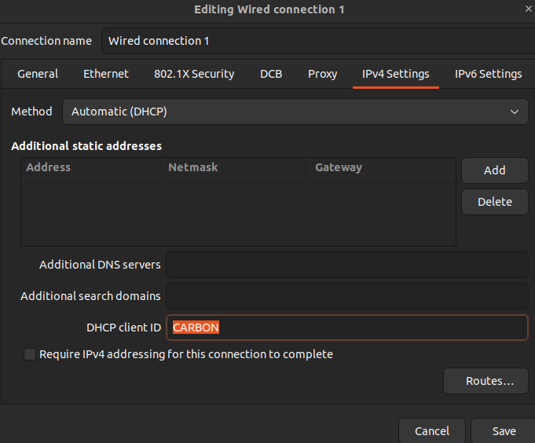
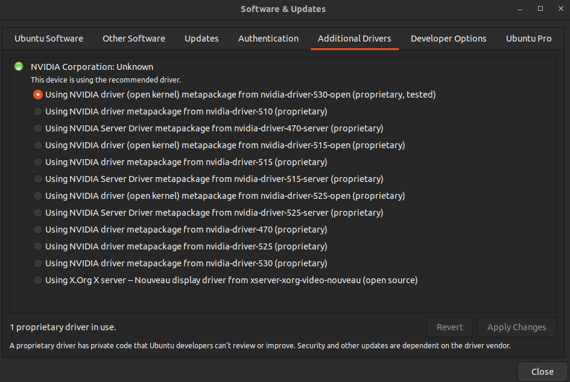

# Install updates/upgrades
```
sudo apt update
sudo apt upgrade
sudo apt autoremove
```
# Upgrade release
```
sudo do-release-upgrade
```

# Wireless network (Eduroam)
* Setup eduroam using these instructions: https://www.universityofgalway.ie/information-solutions-services/servicesforstaff/wifi/eduroam/ 
* Down the "certificate", likely called something like: `nuigalway_Managed_Radius_CA_Root.crt`
* Download and run the python script `eduroam-linux-UoG.py`: 
```
./eduroam-linux-UoG.py 
```
* Now edit the wife connection settings, e.g. by running the following and selecting the wireless connection:
```
nm-connection-editor
```
The below shows the correct settings: 


Note how the `username` is set and how the certificate is selected. 

# Wired internet connection
## Install "Carbon Black"
* Extract the archive e.g. the tar file `cb-psc-sensor-ubuntu-2.14.0.1321525` or an equivalent provided by ISS. 
* Right click the `install.sh` file, Properties, Permissions, tick Allow Execution as Program 
* Run the installation using
```
sudo ./install.sh
```
## Edit wired connection settings
* Now edit the wired connection settings, e.g. by running the following and selecting the wired connection:
```
nm-connection-editor
```
* Go to the `IPv4 Settings`, and set the `DHCP Client id` to `CARBON`. 

The below shows the correct settings: 



# Check of "Additional drivers" e.g. for NVIDIA
Some devices, e.g. the NVIDIA graphics card, might require a proprietary driver, or an alternative driver. The below images shows how one can pick one.


Note some graphics drivers may not be compatible with all software (e.g. MATLAB).

# Install usefull packages
* `git` (and a GUI called `git Cola` if you like)
* `GIMP`
* `Inkscape`
* `Ghostwriter`
* `Xournal++`
* `Meld`
* `Telegram`
* `Slack`
* `MS Teams`
* `VLC` media player
* `Catfish` File Search
* `PDF Chain`
* `FreeCAD`
* `Meshlab`
* `view3Dscene`
* `blender`
* `Shotcut`
* `Peek`

# Configure Git + GitHub SSH

* Follow these instructions to help set-up an SSH key: 
https://docs.github.com/en/authentication/connecting-to-github-with-ssh
E.g.
```
ssh-keygen -t ed25519 -C "your_email@example.com"
```
and press Enter to accept the default file location (or alter the file location if desired). Next type a secure passphrase. 
* To adding your SSH key to the ssh-agent, first start the ssh-agent in the background using
```
eval "$(ssh-agent -s)"
```
Next add the ssh key using: 
```
ssh-add ~/.ssh/id_ed25519
```

* Follow [these instructions](https://docs.github.com/en/authentication/connecting-to-github-with-ssh/adding-a-new-ssh-key-to-your-github-account) to add an SSH key to your GitHub account.
* Use [these instructions](https://docs.github.com/en/authentication/connecting-to-github-with-ssh) to connect to GitHub with SSH.
* You may need to use the following to avoid what might be firewall issues, ([see also this link](https://stackoverflow.com/questions/15589682/ssh-connect-to-host-github-com-port-22-connection-timed-out)), i.e. open a terminal and make the following ssh configuration steps: 
```
sudo nano ~/.ssh/config
```
Next add the following lines: 
```
Host github.com
 Hostname ssh.github.com
 Port 443
```

# Download + install packages
## VS code
* Download .deb file: https://code.visualstudio.com/Download
* Right click, Properties, Permissions, tick Allow Execution as Program 

## Add Julia
* Download: https://julialang.org/downloads/, e.g. the latest 64-bit glibc version
* Extract. 
* Then browse into the extracted folder to find the folder containing the content like the bin folder etc. Copy/cut all content and move to a local folder where you want `julia` to exist e.g. `/home/kevin/julia/`. It is recommended to not have the version tag in this folder name, since using just  `julia` rather than `julia-1.8.5` means the symbolic links can stay constant when you upgrade `julia` in the future. 

* Setup `julia` symbolic links

```
sudo ln -s /home/kevin/julia/bin/julia /usr/bin/julia
```
* Add the `julia` path to `PATH`
```
export PATH="$PATH:/home/kevin/julia/bin"
```

### Julia packages to add: 
* `IJulia` for jupyter notebook functionality
```
]add IJulia
```
* `Gridap` for `julia` based finite element analysis
```
]add Gridap
```
* [`Makie`](https://docs.makie.org/stable/) for advanced visualisation
```
]add GLMakie
```

## Git
* Install
```
sudo apt install git
```
* Configure `git` with the correct user name and user email ([see also this link](https://git-scm.com/book/en/v2/Getting-Started-First-Time-Git-Setup))
	* Set user name: 
```
git config --global user.name "Kevin-Mattheus-Moerman"
```
	* Set user email: 
```
git config --global user.email kevin.moerman@gmail.com
```

## Install Conda
* Download the installation `.sh` file [here](https://www.anaconda.com/download/).
* Right click, `Properties`, `Permissions`, tick `Allow Execution as Program` 
* Open a terminal in that folder run equivalent of:
```
./Anaconda3-2023.03-Linux-x86_64.sh
```
### Conda packages to add: 
* `Jupyter notebooks` 
```
conda install jupyter
```
* The [`RISE`](https://rise.readthedocs.io/en/stable/installation.html) `Jupyter` notebook add on, allowing `Jupyter` based presentations. 
```
conda install -c conda-forge rise
```
* [Octave kernel](https://pypi.org/project/octave-kernel/)
```
conda config --add channels conda-forge
conda install octave_kernel
conda install texinfo # For the inline documentation (shift-tab) to appear
```

## GNU Octave
Octave, an open source AMTLAB alternative (which is easier to set-up for Jupyter notebooks) can be installed as below or via snap or [via conda](https://anaconda.org/conda-forge/octave). 
```
sudo apt install octave
```
Conda might provide the latest version whereas the above might install a rather old version. 
 

## Tex / LATeX (SLOW/LONG!)
```
sudo apt install texlive-full
```

## TexMaker
```
sudo apt install texmaker
```

## Grsync
`grsync` is a GUI for the `rsync` system for backing up/synchronising between two folders. You can install `grsync` using: 
```
sudo apt-get -y install grsync
```
## Zotero
Download and setup automated updating, see also instructions on this [GitHub page](https://github.com/retorquere/zotero-deb):
```
wget -qO- https://raw.githubusercontent.com/retorquere/zotero-deb/master/install.sh | sudo bash
sudo apt update
sudo apt install zotero
```
After installation opening Zotero will help you to install the LibreOffice plug-in, as well as the browset (e.g. Firefox) extension.

# Get LibreOffice plugins
* TexMaths https://extensions.libreoffice.org/en/extensions/show/texmaths-1, download the OXT file, go to LibreOffice Writer, Tools, Extension Manager, Add, then browse to the OXT file. 
* Zotero, see Zotero section above

# MATLAB
* Download installer
* Right click, Properties, Permissions, tick Allow Execution as Program 
* Extract
* Browse to folder containing `install`, open a terminal and run: 
```
./install
```
Do not run the install as administrator. You can create symbolic links later
* 
* Follow these instructions: 
https://uk.mathworks.com/matlabcentral/answers/1468426-cannot-enable-hardware-opengl-r2021b-ubuntu-20-04, which state that in your `home` folder (or where ever you run a terminal to execute `matlab`) you should add a file called `java.opts` and add the following line: 
```
-Djogl.disable.openglarbcontext=1
```
* Create the symbolic links
```
sudo ln -s /home/kevin/matlab/bin/matlab /usr/bin/matlab
```
Export path
```
export PATH="$PATH:/home/kevin/matlab/bin"
```
* Install the MATLAB support package
```
sudo apt install matlab-support
```
* Rename https://uk.mathworks.com/matlabcentral/answers/241850-matlab-failing-to-find-hardware-opengl
* Similar to: 
```
cd /home/kevin/matlab/sys/os/glnxa64/
$ sudo mv libstdc++.so.6 libstdc++.so.6.bak
```
# Jekyll (GitHub based website making)
https://jekyllrb.com/docs/installation/ubuntu/
```
sudo apt-get install ruby-full build-essential zlib1g-dev
```

```
echo '# Install Ruby Gems to ~/gems' >> ~/.bashrc
echo 'export GEM_HOME="$HOME/gems"' >> ~/.bashrc
echo 'export PATH="$HOME/gems/bin:$PATH"' >> ~/.bashrc
source ~/.bashrc
```
Add/install Jekyll:
```
gem install jekyll bundler
```
You can test the building of a website locally using: 
```
bundle exec jekyll serve
```
Remove the website / clean up using: 
```
bundle exec jekyll clean
```
To update ruby gems, go to the website folder where the gemlock file is and use: 
```
bundler update
```
# Ubuntu things
* Enable add new empty file on right click e.g. 
```
touch ~/Templates/newTextFile.txt
```
## Tweaks
For easy custom appearance/behaviour setting changes
```
sudo apt install gnome-tweak-tool
```

## Minimize on click 

Clicking on icon minimises open window 
```
sudo apt install dconf-editor
```

```
dconf-editor
```
Navigate to /org/gnome/shell/extensions/dash-to-dock.

Scroll down to the "click-action" tab

At the bottom of the click-action panel is an option for ‘default value’. Slide this to the off position. Then click the “custom value” button to access a list of options.

Select 'minimize'

## Add "restricted extras" 
The restricted extras consists of proprietary fonts and codecs
```
sudo apt install ubuntu-restricted-extras
```
## Set tray icon click to show preview of application windows for an application
```
gsettings set org.gnome.shell.extensions.dash-to-dock click-action 'previews'
```

